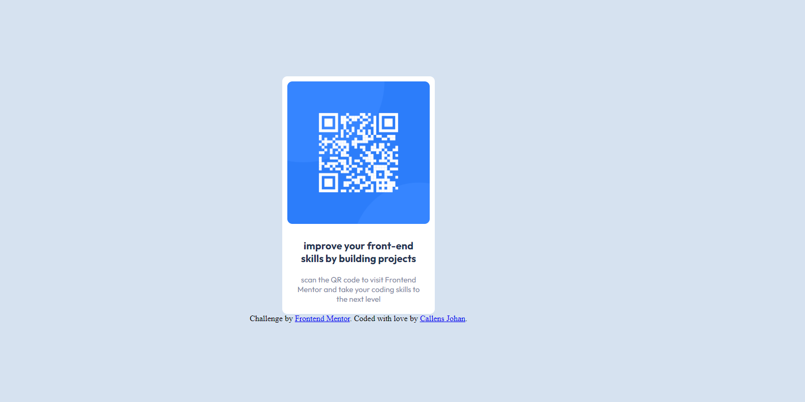

# Frontend Mentor - QR code component solution

This is a solution to the [QR code component challenge on Frontend Mentor](https://www.frontendmentor.io/challenges/qr-code-component-iux_sIO_H). Frontend Mentor challenges help you improve your coding skills by building realistic projects. 

## Table of contents

- [Overview](#overview)
  - [Screenshot](#screenshot)
  - [Links](#links)
- [My process](#my-process)
  - [Built with](#built-with)
  - [What I learned](#what-i-learned)
  - [Continued development](#continued-development)
  - [Useful resources](#useful-resources)
- [Author](#author)
- [Acknowledgments](#acknowledgments)

**Note: Delete this note and update the table of contents based on what sections you keep.**

## Overview

### Screenshot

### Links

- Solution URL: [https://github.com/CallensJ/qrcode]
- Live Site URL: [https://callensj.github.io/qrcode/]

## My process

### Built with

- Semantic HTML5 markup
- CSS(SASS)
- Flexbox

### What I learned
reviewed somes basic flexbox rules since did not use it for a while now 

### Continued development

### Useful resources

## Author

- Frontend Mentor - [https://www.frontendmentor.io/profile/johan030]
- Twitter - [https://www.twitter.com/johan_callens]

## Thanks
I did it on my own , just wanted to thanks Jonas Schmedtmann even i know he'll never stop on my github haha.
i follow his courses from the begining . i just finished css master level II course before trying frontend mentor. 
Let's see how far i'll be able to go 
